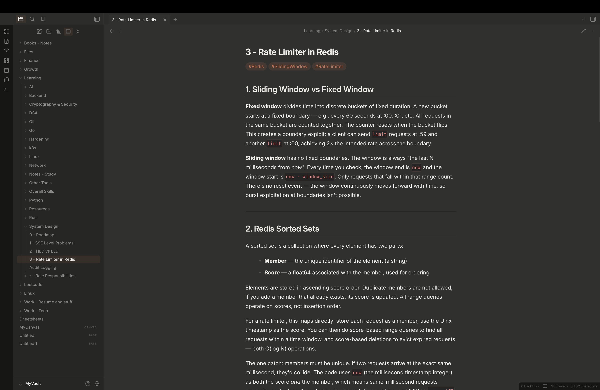

# Claude — Obsidian Theme

A dark theme for [Obsidian](https://obsidian.md) inspired by the Claude AI chat interface. Clean, neutral dark tones with a focus on readability.

---

## Features

- Neutral dark palette matching the Claude.ai interface
- Inter font for UI and body text; JetBrains Mono for code
- Syntax highlighting tuned for dark backgrounds (purple, green, blue, cyan, orange)
- Reading mode and live preview styled consistently
- Independent sidebar and editor background colors
- Inline code and code block colors distinct from body text

## Installation

**Via Community Themes (recommended)**

1. Open Obsidian Settings → Appearance → Themes
2. Search for **Claude**
3. Click Install, then Enable

**Manual**

1. Download `theme.css` from this repository
2. Copy it to `.obsidian/themes/Claude/theme.css` inside your vault
3. Enable it in Settings → Appearance → Themes

## Requirements

Obsidian 1.12.4 or later.

## Author

[Arun G](https://github.com/arun-gajaraj)
